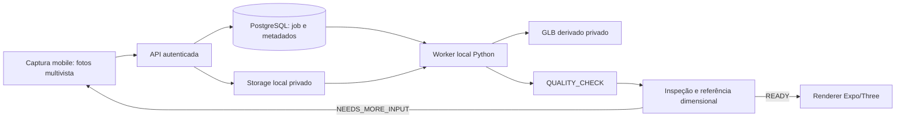

# Arquitetura 3D — CICLO 2

O caminho implementado mantém binários pessoais fora do Git e fora de URLs públicas. A POC executa no computador de desenvolvimento; não introduz cloud, GPU alugada ou object storage.

`reconstruction_jobs` registra estado, pessoa, item ou produto, técnica, versão do pipeline, tentativa, revisão de inputs, tempos, métricas, quality e placement. `reconstruction_inputs` liga somente mídia READY da mesma pessoa e do contexto correto. `reconstruction_outputs` mantém somente GLB derivado, checksum, metadados e lifecycle. O banco guarda metadados; o storage privado guarda fotos e binários.

O worker faz claim transacional com lease, revalida hashes recebidos, executa Python sem shell, limita threads e prazo, confere proveniência/checksum/limite do GLB e só então persiste saída. Falhas de processamento não podem produzir READY. READY exige inspeção explícita, referência dimensional declarada e o quality gate configurável.

O renderer carrega o GLB via endpoint autenticado e privado. A composição só recebe um job READY com `compositionReady`; aplica escala uniforme calculada a partir da dimensão declarada. Não há simulação de tecido, colisão, fitting técnico ou análise metodológica nesta POC.
