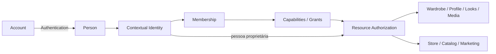
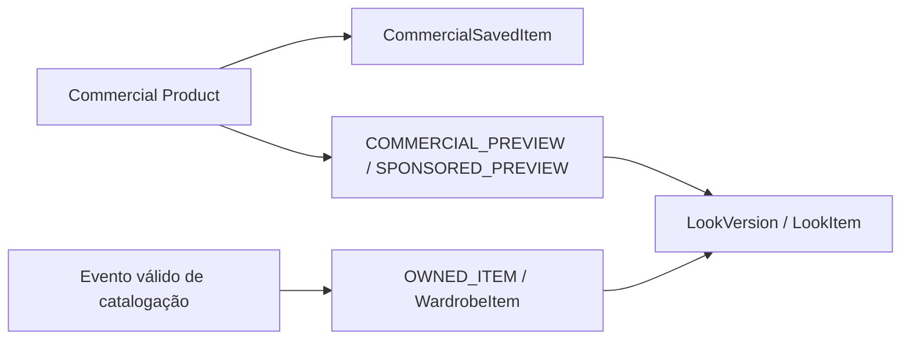

# UNIVERSO ÍMPAR — arquitetura da fundação e CICLO 2

CICLO 1 estabeleceu a fundação; o CICLO 2 acrescenta uma POC de reconstrução multivista local,
privada e rastreável. Ela não é ainda um serviço de produção nem uma garantia de fitting.
Fontes: requisitos explícitos do ciclo e auditorias do CICLO 0. Originais da Especificação
Executiva/Prompt Mestre não estavam disponíveis no checkout; não se presume sua leitura.

Authentication identifica conta ativa e pessoa. JWT contém sub/account, versão de sessão,
issuer/audience, algoritmo HS256 e expiração de uma hora. A conta é reconsultada a cada requisição;
logout incrementa token_version. Tokens antigos exigem novo login. Não há role global confiável
no token. Password bcrypt custo 12, validação de entrada e limitador específico de auth.

Authorization pessoal confere `person_id` do recurso. Privado inexistente ou de outra pessoa
retorna 404; sem sessão retorna 401. Capacidade ausente no contexto retorna 403. A autorização
comercial confere Person, Organization, Membership ativa, Capability, Grant vigente e escopo
de recurso. `X-Organization-Id` seleciona contexto; uma única membership permite fallback
compatível. Mais de uma exige seleção explícita; loja na rota prevalece sobre header.

OWNER/ADMIN/MANAGER/CATALOG_EDITOR/MARKETING/VIEWER são bundles declarativos de capabilities.
Os controllers não tomam decisões por esses nomes. MARKETING recebe marketing.write,
analytics.read e store.read. Membros podem ser adicionados/reconfigurados/revogados por
members.manage, com auditoria de grants; a última capacidade de gerir membros é preservada.
Cadastro legado STORE cria organização e membership, mantendo perfil e armário pessoal.
Solicitações de loja ficam PENDING; não implementamos aprovação/compliance comercial automático.

**Commercial Product ≠ Owned Wardrobe Item.** Salvar, visualizar, anunciar, comparar ou compor
um Look não cria evento de posse, item de armário ou consumo de capacidade. `/copy-to-wardrobe`
retorna 410 e indica `/products/{id}/save`. Novos itens exigem declaração explícita de catalogação
MANUAL_CATALOG ou REAL_CAPTURE (esta exige mídia validada). Isso registra a declaração do usuário;
não é certificação externa de propriedade. O schema reserva VERIFIED_PURCHASE/VALIDATED_IMPORT,
mas a API ainda não aceita essas fontes. Não foram inventadas integrações de compra.

Produtos/saves legados migram preservando IDs e origem. Cópias e catalogação antiga sem evidência
ficam em legacy_item_reviews; não entram automaticamente em OWNED_ITEM. Os registros originais
permanecem. Looks existentes tornam-se privados; versões novas têm FKs e kinds explícitos.
Capacidade é verificada na aplicação e em trigger transacional sobre wardrobe_items.

Mídia: adapter privado local de desenvolvimento, nomes UUID, metadados de pessoa/contexto,
validação MIME/decodificação, reencode sem EXIF e limites de bytes/pixels/concorrência. Não há
URL pública para upload pessoal nem fallback que finja armazenamento. O endpoint de acesso
resolve autorização e prepara signed URLs futuras. Arquivos legados em provedor externo exigem
inventário/revogação operacional; removê-los da resposta da API não revoga URLs já compartilhadas.
Veja [política de upload](upload-policy.md).

Expo/Showcase: estado persistido por namespace demo/person, com remount da árvore na troca de
identidade, proteção contra hidratação atrasada e arrays vazios preservados. A antiga chave
global fica em quarentena local sem importação ou exclusão automática. Apenas `demo-person`
recebe armário/perfil/coleções fictícios; o lojista pode alternar para seu contexto pessoal.
Cadastro demo cria identidade fictícia nova, sem representar autenticação real. Dados em demo
não são sincronizados à API. `demoMode=false` apresenta uma superfície real de leitura da API;
integração completa das telas continua pendente, sem mutações locais apresentadas como reais.

3D: renderer genérico native preexistente preservado como experimento. Foto animada é prévia
visual, não modelo validado. O CICLO 2 acrescenta captura multivista autenticada, jobs de
reconstrução, worker CPU local, GLB privado, quality gate e composição proporcional com avatar
de referência. Não há reconstrução corporal, fitting, física de tecido ou compra. Veja a
[arquitetura 3D](3d/architecture.md), o [estado auditado](3d/current-state.md) e o
[caminho de produção](3d/production-path.md).

Persistência e deploy: migrations versionadas, checksum normalizado LF, transação/advisory lock,
adoção explícita do schema legado e rollback de índices quando seguro. Compose deixa de montar
SQL no initdb e executa runner antes da API; PostgreSQL/Redis sem portas públicas, mídia em volume
privado, API com usuário node. `/health` mede processo e `/ready` confere banco/schema. Redis
obrigatório bloqueia startup se falhar; limitadores HTTP ainda são por processo, não Redis.
Ver [migrations](migrations.md), [ERD](data-model.md) e [OpenAPI](openapi.yaml).

IP/knowledge: [classificação por arquivo](ip-classification.md). Conteúdo da Dani permanece
material demonstrativo sob revisão; não há RAG institucional/pessoal nem conhecimento aprovado
em produção. Antes de nova distribuição, separar conteúdo privado da interface pública por IDs,
proveniência, revisão, aprovação e versionamento. O ciclo não altera histórico nem publica assets.
