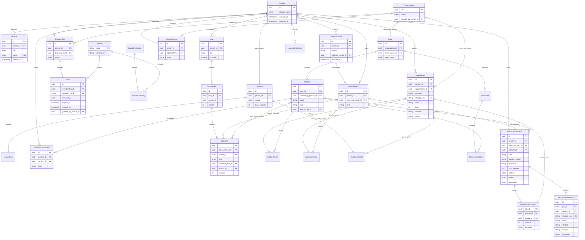

# Modelo de dados — CICLO 1

Nomes conceituais abaixo mapeiam para tabelas snake_case/plural. `Grant` é a tabela `grants`;
bundles são dados em `capability_bundles`/`bundle_capabilities`, não condições em controllers.

Invariantes: Person+Organization única por membership; Identifier(kind,value) único; e-mail
normalizado único; grants ativos sem duplicatas por escopo; evento de ownership único por peça;
FK composta impede atribuir evento/peça/Look a outra pessoa; LookItem exige exatamente uma
referência compatível com kind; ShowcaseProduct exige mesmo Store. Mídia privada só pode ser
vinculada à pessoa correspondente; mídia comercial à organização correspondente, com triggers.

Há um Account por Person neste bridge. Multiplicidade futura de credenciais/contas exige migrar
perfil/plano de `users` para Person antes de remover essa unicidade. Não se faz merge automático
de identidades por e-mail ou telefone. `verified_at` nasce vazio: cadastro não verifica identificador.
`owner_user_id`, `profile_type`, items/item_saves e arrays legados permanecem compatibilidade/
histórico; os endpoints novos não usam esses campos como autoridade nem prova de posse.
Looks legados ficam privados, preservados sem reinterpretar arrays antigos como ownership válido.

Reconstrução exige exatamente um item pessoal ou produto comercial e preserva a pessoa no job,
input e output. Trigger de banco impede mídia de outra pessoa, mídia fora do contexto comercial e
mídia não READY. A saída é GLB derivado privado; seu lifecycle e checksum são metadados de banco,
enquanto o binário permanece no storage privado. READY é estado posterior ao quality gate, não ao
upload nem à execução do worker.
